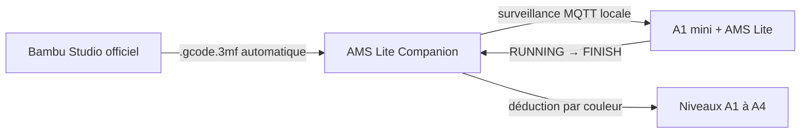

# AMS Lite Companion

Application macOS communautaire pour suivre le filament restant sur une
**Bambu Lab A1 mini équipée d’un AMS Lite**.

Companion fonctionne avec la version officielle et signée de Bambu Studio. Il
ne modifie pas le slicer et n’envoie aucune commande d’impression : sa
passerelle récupère automatiquement le `.gcode.3mf` créé par Bambu Studio lors
de l’envoi, surveille localement l’état de l’imprimante et met à jour les
bobines lorsque l’impression se termine correctement.

> Projet indépendant et non officiel, sans affiliation avec Bambu Lab.

## Fonctionnement



L’AMS Lite ne pèse pas les bobines génériques. Companion utilise donc les
valeurs `used_g` calculées par le trancheur. Les niveaux restent des
estimations et peuvent être corrigés manuellement après une pesée.

## Points principaux

- application native dans la barre des menus macOS ;
- panneau intégré accolé à la fenêtre de Bambu Studio, sans onglet navigateur ;
- lancement de Bambu Studio officiel sans erreur de signature ;
- suivi indépendant des emplacements A1 à A4 ;
- impressions monochromes et multicolores ;
- récupération automatique du fichier temporaire de Bambu Studio ;
- correspondance A1–A4 enregistrée et configurable pour l’armement automatique ;
- extraction multifilament depuis `Metadata/slice_info.config` ;
- connexion MQTT TLS directe sur le réseau local ;
- déduction uniquement après `RUNNING → FINISH` ;
- aucune déduction après annulation ou échec ;
- protection contre les doubles déductions ;
- conservation du travail actif après redémarrage ;
- arrêt automatique lorsque Bambu Studio est fermé ;
- aucun service permanent en arrière-plan ;
- aucune dépendance Python externe.

## Compatibilité

- macOS 10.15 ou ultérieur sur Mac Intel ;
- macOS 11 ou ultérieur sur Apple Silicon ;
- Python 3 installé ;
- Bambu Studio officiel placé dans `/Applications` ;
- A1 mini et Mac connectés au même réseau local.

L’application distribuée est universelle : elle contient les architectures
`x86_64` et `arm64`.

## Installation rapide

1. Pour tester le panneau natif, ouvrez la [bêta v1.3.0-beta.2](https://github.com/laurentmamelli-max/AMS-Lite_Companion/releases/tag/v1.3.0-beta.2).
2. Téléchargez `AMS-Lite-Companion-1.3.0-macOS.zip`.
3. Décompressez l’archive.
4. Glissez `AMS Lite Companion.app` dans `/Applications`.
5. Au premier lancement, faites un clic droit sur l’application puis
   **Ouvrir**.

L’application est signée de manière ad hoc par le processus de construction,
mais elle n’est pas notariée par Apple. La confirmation du premier lancement
est donc normale.

Si Python 3 n’est pas installé :

```bash
brew install python
```

## Première configuration

1. Lancez `AMS Lite Companion.app`.
2. Bambu Studio officiel et le panneau Companion s’ouvrent automatiquement.
3. Dans les paramètres réseau de l’A1 mini, relevez :
   - son adresse IP ;
   - son numéro de série ;
   - son code d’accès LAN.
4. Saisissez ces données dans Companion.
5. Donnez un nom et un poids initial à chaque bobine A1–A4.
6. Cliquez sur **Enregistrer et connecter**.
7. Dans **Passerelle Bambu Studio**, vérifiez la correspondance de secours :
   filament 1 vers A1, filament 2 vers A2, etc. Modifiez-la si votre projet
   utilise une autre disposition.

Sur certains firmwares, l’accès MQTT local nécessite l’activation du mode
développeur dans les paramètres réseau de l’imprimante.

## Utilisation pour une impression

1. Préparez et tranchez le plateau dans Bambu Studio.
2. Cliquez normalement sur **Imprimer le plateau**.
3. Vérifiez dans Companion que le travail passe à **Armé automatiquement**.
4. Confirmez que la source affichée est **Correspondance enregistrée** et que
   ses associations correspondent aux voies réellement sélectionnées.

Aucun export ni import manuel n’est normalement nécessaire. L’import manuel
reste disponible en secours si une version future de Bambu Studio change son
dossier temporaire.

Companion attend une transition réelle de l’imprimante de `RUNNING` vers
`FINISH`. Il effectue alors une seule déduction et l’ajoute à l’historique.

## Impression multicolore

Chaque filament est comptabilisé séparément. Exemple :

| Filament tranché | Emplacement | Consommation | Avant | Après |
|---|---:|---:|---:|---:|
| PLA noir | A1 | 18,2 g | 1 000 g | 981,8 g |
| PLA blanc | A3 | 7,4 g | 800 g | 792,6 g |
| PLA rouge | A4 | 2,1 g | 500 g | 497,9 g |

Le firmware de certaines A1 mini ferme la connexion des clients tiers qui
tentent de s’abonner au canal MQTT des commandes. Pour préserver une connexion
stable, Companion emploie la correspondance enregistrée dans le tableau de
bord. Celle-ci doit correspondre aux emplacements réellement utilisés dans
l’AMS Lite. La consommation dépend des données du trancheur et peut inclure les
changements de couleur et les purges selon le projet.

## Menu macOS

L’icône Companion dans la barre des menus permet de :

- voir l’état de la connexion et de l’impression ;
- consulter les niveaux A1–A4 ;
- afficher ou masquer le panneau Companion ;
- activer ou désactiver son suivi de la fenêtre Bambu Studio ;
- ouvrir le tableau complet dans le navigateur si nécessaire ;
- ouvrir Bambu Studio ;
- redémarrer le moteur de suivi ;
- afficher le journal ;
- quitter complètement Companion.

Lorsque Bambu Studio est fermé, Companion se ferme automatiquement après deux
contrôles successifs, soit environ six secondes.

## Panneau intégré

La version 1.3 affiche le tableau de bord dans une fenêtre macOS native à côté
de Bambu Studio. Le panneau présente d’abord les bobines, puis l’état de
l’imprimante, la passerelle automatique et l’historique. Il suit les
déplacements de Bambu Studio tant que l’option **Suivre la fenêtre Bambu
Studio** est cochée dans le menu.

Pour déplacer le panneau librement, décochez cette option. Sa fermeture masque
seulement l’interface : le suivi continue et le panneau peut être réaffiché
depuis l’icône de la barre des menus. Le tableau complet reste accessible dans
le navigateur pour l’import manuel de secours et l’arrêt du moteur.

## Données et confidentialité

L’interface web écoute uniquement sur `127.0.0.1:8765`. Les données restent
sur le Mac dans :

```text
~/Library/Application Support/AMS Lite Companion/state.json
```

Le journal de diagnostic se trouve dans :

```text
~/Library/Application Support/AMS Lite Companion/companion.log
```

`state.json` est créé avec les droits `0600`, mais il contient le code d’accès
LAN afin de permettre la reconnexion. Ne publiez jamais ce fichier et ne le
joignez pas à une issue GitHub.

Une mise à jour de l’application ne supprime ni les niveaux ni l’historique.

## Dépannage

### L’application ne s’ouvre pas

Effectuez un clic droit sur `AMS Lite Companion.app`, choisissez **Ouvrir**,
puis confirmez. Vérifiez également que Python est disponible :

```bash
python3 --version
```

### Bambu Studio est introuvable

Installez la version officielle dans l’un des emplacements suivants :

```text
/Applications/BambuStudio.app
/Applications/Bambu Studio.app
```

### L’imprimante reste déconnectée

- vérifiez l’adresse IP ;
- vérifiez le numéro de série et le code LAN ;
- confirmez que le Mac et l’imprimante sont sur le même réseau ;
- contrôlez le mode développeur de l’imprimante ;
- ouvrez le journal depuis le menu Companion.

L’erreur `nodename nor servname provided, or not known` correspond généralement
à une adresse IP vide ou incorrecte.

### Le port 8765 est déjà utilisé

Une ancienne instance est probablement encore active. Ouvrez
<http://127.0.0.1:8765>, cliquez sur **Arrêter Companion**, puis relancez
l’application.

### Aucun poids n’est déduit

Vérifiez l’état de la carte **Passerelle Bambu Studio**, la correspondance de
secours A1–A4 et que le travail était indiqué comme **Armé** avant le démarrage.
Le journal doit contenir `archive détectée`, puis `travail armé
automatiquement`. En l’absence de détection, utilisez temporairement l’import
manuel et joignez le journal à un rapport de problème sans publier
`state.json`.

## Construire l’application

Les outils Apple et Python 3 sont nécessaires :

```bash
xcode-select --install
brew install python
git clone https://github.com/laurentmamelli-max/AMS-Lite_Companion.git
cd AMS-Lite_Companion
chmod +x Construire_Application_macOS.command
./Construire_Application_macOS.command
```

Le script :

- compile les variantes Apple Silicon et Intel ;
- assemble un exécutable universel ;
- crée le bundle `.app` ;
- applique une signature ad hoc ;
- vérifie la signature ;
- produit l’archive dans `dist/`.

## Tests

```bash
python3 -m unittest -v test_companion.py
python3 -m py_compile ams_companion.py test_companion.py
```

GitHub Actions teste le moteur sur plusieurs versions de Python et construit
l’application sur un runner macOS avant publication.

## Limites

- Le poids est estimé par le trancheur et non mesuré physiquement.
- Si la commande AMS locale n’est pas retransmise au Companion, la
  correspondance de secours doit refléter la disposition A1–A4 du projet.
- Un changement futur du dossier temporaire de Bambu Studio peut nécessiter
  une mise à jour de la passerelle ; l’import manuel reste disponible.
- Les impressions partielles annulées ne sont pas débitées automatiquement.
- Une pesée occasionnelle reste recommandée pour corriger la dérive.
- Les autres modèles d’imprimantes Bambu ne sont pas encore validés.

## Licence

AMS Lite Companion est distribué sous licence [MIT](LICENSE).

Bambu Studio, Bambu Lab, A1 mini et AMS Lite sont des marques de leurs
propriétaires respectifs.
